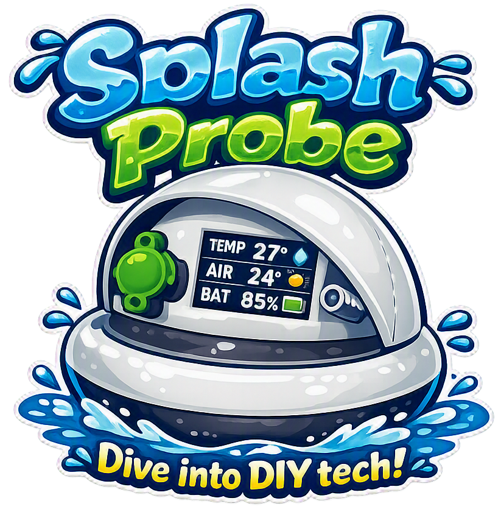
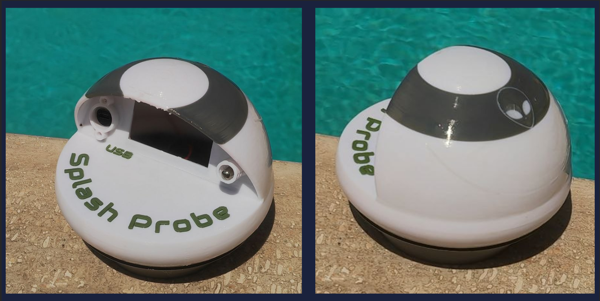
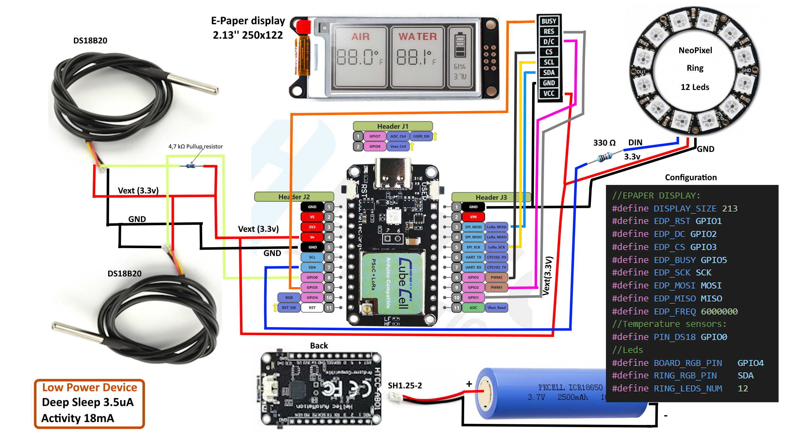
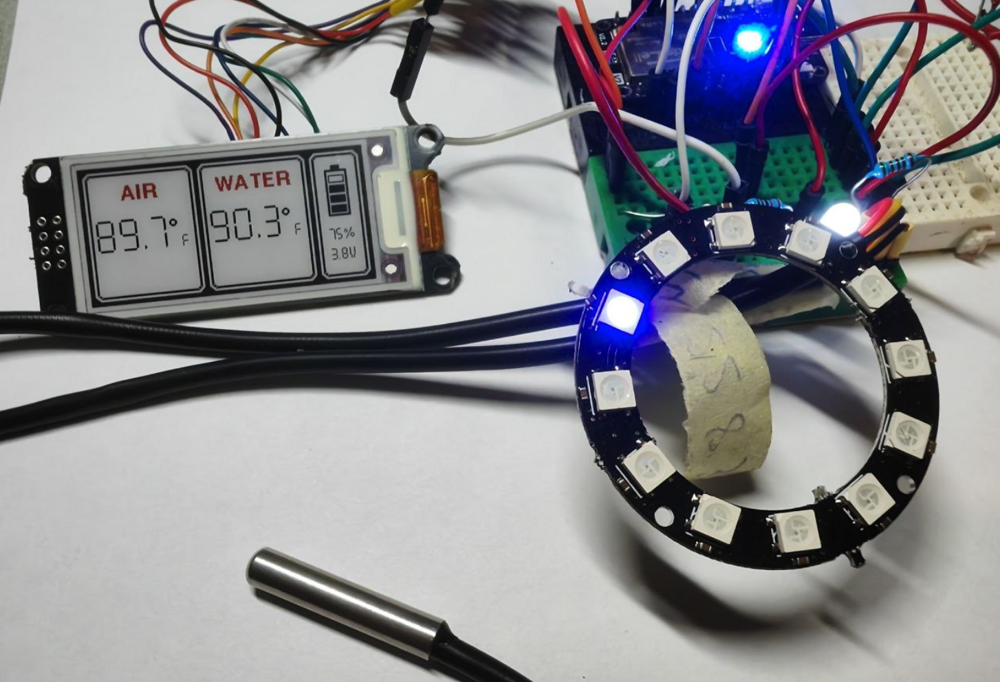
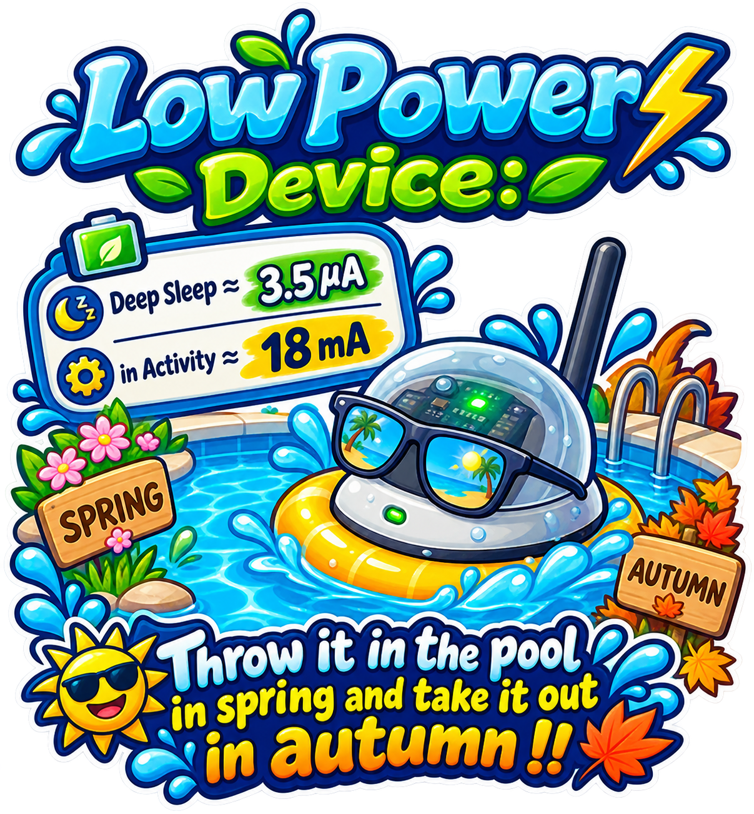
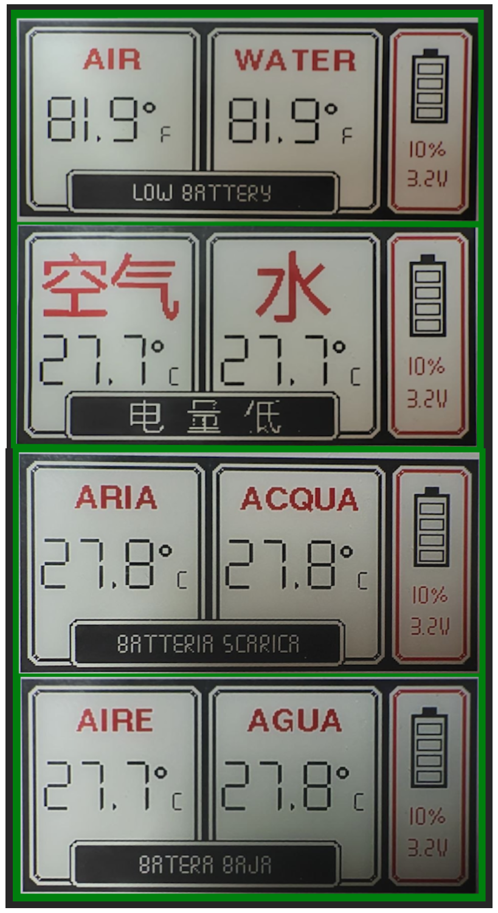

<p align="center">
  
</p>

**Splash Probe** is an open-source, floating smart sensor designed for swimming pools. It measures both ambient outdoor air temperature and water temperature while adding an aesthetic touch with customizable underwater light effects.

---
<p align="center">
  
</p>

---
<p align="center">
  
</p>

---
<p align="center">
  
</p>
---


## ✨ Features

- **Dual Temperature Monitoring:** Reads both external ambient air and pool water temperatures simultaneously using high-precision digital sensors.
- **Ambient Light Effects:** Features a 12-LED NeoPixel ring that lights up underwater for a customizable light show.
- **Ultra-Low Power Consumption:** Optimized deep-sleep cycles allow for extended battery life.
- **E-Paper Display:** High-contrast, sunlight-readable 2.13" e-Paper display for clear outdoor visibility.
- **Native Battery Management:** Powered by a rechargeable 18650 LiPo battery managed directly by the board.

---

## ⚙️ How It Works (Duty Cycle)

To maximize battery efficiency, the device operates on a timed deep-sleep schedule:
<p align="center">
  
</p>


1. **Every 5 minutes:** The device wakes up, turns on the 12-LED NeoPixel ring to perform a light effect, and returns to **Deep Sleep**.
2. **Every 30 minutes (6 light cycles):** The device performs a full system check:
   - Reads ambient air and water temperatures.
   - Measures the current battery voltage.
   - Refreshes the 2.13" e-Paper display with the updated readings.
   - Goes back to **Deep Sleep**.

---

## 📊 Technical Specifications

| Parameter | Value |
| :--- | :--- |
| **Microcontroller** | Heltec CubeCell HTCC-AB01 (v2) |
| **Display** | 2.13" e-Paper Display |
| **Sensors** | 2x DS18B20 Waterproof Temperature Sensors |
| **Lighting** | 12-LED NeoPixel RGB Ring |
| **Power Supply** | 18650 LiPo Battery (1300 mAh) |
| **Deep Sleep Current** | ~35 µA |
| **Active Current** | ~18 mA |
| **Estimated Battery Life**| 3 to 5 months (depending on light patterns) |

---

## 🛠️ Assembly & Build Guides

Follow these step-by-step guides to build your own Splash Probe:

1. **[Bill of Materials (BOM)](docs/BOM.md):** Complete list of hardware components, tools, and materials needed.
2. **[3D Printing & Post-Processing Guide](docs/WATERPROOFING.md):** Printing settings, surface treatment, and waterproofing/sealing instructions for the printed enclosure.
3. **[Circuit & Wiring Diagram](docs/CIRCUIT.md):** Detailed wiring instructions, schematics, and pinout diagrams.
4. **[Source Code & Flashing Guide](docs/FIRMWARE.md):** Information on setting up the environment, configuring the code, and flashing the CubeCell board.

---

## 🖨️ 3D Models

The 3D printable enclosure is designed to be fully buoyant and watertight.

👉 **[Download 3D Models on MakerWorld](https://makerworld.com/en/search/models?keyword=Splash%20Probe)** *(replace with your actual link)*

<p align="center">
  
</p>

---

## 💻 Firmware & Architecture

The board operates using a **Finite State Machine (FSM)** architecture. To minimize power consumption, it spends most of its time in a **Deep Sleep** state:

* **Every 5 minutes:** A hardware timer wakes the board up to execute the NeoPixel LED light sequence.
* **Every 30 minutes (6 light cycles):** The system reads the temperature sensors, measures battery status, and updates the e-Paper display.

The main logical flow is straightforward and can be inspected in `main.h`.

### ⚙️ Configuration (`sys.h`)

All core system parameters and PIN configurations are managed inside `sys.h`:

- **Debug Mode:** `inline bool debug = true;` — Output status messages to the Serial console. Set to `false` for production/release builds to save power.
- **Localization & Units:** `inline Language Lang = en;` / `inline DataMode dataMode = Celsius;` — Sets the preferred language (**English `en`**, **Italian `it`**, or **Spanish `es`**) and temperature unit (**Celsius** or **Fahrenheit**).
- **Sleep Timer:** `inline const uint32_t SLEEP_DURATION_MS = 5 * 60 * 1000UL;` — Controls the 5-minute interval between wake-ups to run the LED sequence.
- **Sensor Refresh Rate:** `#define SENSORS_EVERY_N_CYCLES 6` — Triggers temperature readings and e-Paper refresh every 6 light cycles (30 minutes).

### 🌐 Multi-Language Strings

Text labels displayed on the e-Paper screen can be customized or extended in `sys.h`:

```cpp
inline const char* airText[]   = {"ARIA", "AIR", "AIRE"};
inline const char* waterText[] = {"ACQUA", "WATER", "AGUA"};
inline const char* lowBatt[]   = {"Batteria Scarica", "Low Battery", "Batería baja"};
```
---
<p align="center">
  
</p>


---

## 🤝 Contributing

Contributions, issues, and feature requests are welcome! Feel free to check the [issues page](../../issues) if you want to contribute or report a bug.

---

## 📜 License

This project is open-source and available under the [MIT License](LICENSE).